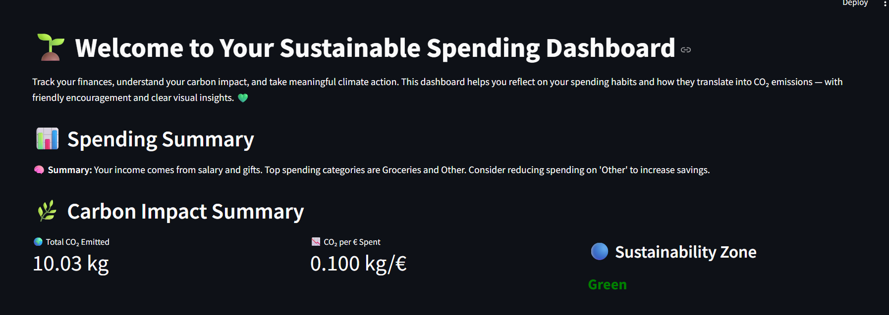
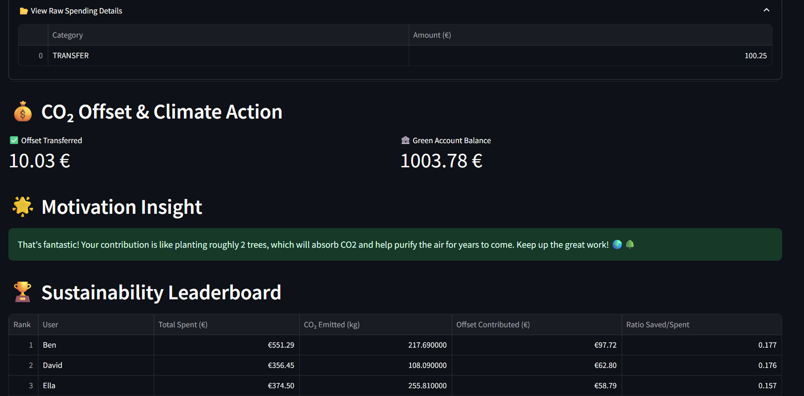

# 🌍 Sustainable Spending Dashboard

An AI-powered dashboard that analyzes your spending habits, estimates your carbon footprint, and encourages climate-friendly financial decisions — built with **Streamlit**, **LLMs**, and **Bunq**. 

The Dashboard looks like this(cool right!) 




---

## 💡 What It Does

This dashboard connects financial data with climate awareness using the power of LLMs. It helps you:

- Understand where your money goes 💸  
- See how your spending impacts the planet 🌱  
- Take climate action via automated CO₂ offset transfers ♻️  
- Compete (gently!) with others in a sustainability leaderboard 🏆

---

## 🧠 Powered By

| Technology         | Role                           |
|--------------------|--------------------------------|
| `Streamlit`        | Dashboard UI & interactivity   |
| `pydantic_ai`      | Agent orchestration + LLM I/O  |
| `Gemini` / `OpenAI`| Spending & CO₂ reasoning        |
| `Bunq SDK`         | Carbon offset transfers        |
| `Pandas`, `Matplotlib` | Data processing & charts  |

---

## 📂 Project Structure
```
.
├── dashboard.py # Streamlit dashboard
├── v1_agents.py # pydantic agents & logic
├── wrapper.py # Bunq integration wrapper
├── data/ 
│ └── transactions.csv # Sample transactions
├── .env # Bunq API key
├── requirements.txt
└── README.md
```
## ✨ Features

✅ Classify spending into intuitive categories  
✅ Calculate total CO₂ emissions and CO₂ per € spent  
✅ Assign a sustainability zone (Green / Yellow / Red)  
✅ Visualize insights in a modern, intuitive dashboard  
✅ Transfer offset amounts to a Bunq green account 💚  
✅ Display motivational messages like “you planted 3 trees!” 🌳  
✅ See how you compare on a gamified leaderboard 🏆  

---

## 🛠 Setup Instructions

### 1. Clone the Repo

```bash
git clone https://github.com/your-username/bunq-hackathon-agents-6.0.git
cd bunq-hackathon-agents-6.0
```
2. Create a Virtual Environment
```bash
python -m venv venv
source venv/bin/activate  # On Windows: venv\Scripts\activate
```
3. Install Requirements
```bash

pip install -r requirements.txt
```
4. Add a .env File
Create a .env file in the root folder with:
```
BUNQ_API_KEY=your_bunq_api_key_here
```

5. 🚀 Run the App

``` bash
streamlit run dashboard.py
```

🌟 Example Insights

🌿 You just offset 25 kg of CO₂ — that’s like planting 1.2 trees!
💬 Most of your spending goes to groceries and travel. Try biking more often to reduce your footprint.
🏦 You transferred €40 to your green account. Nice work!


🏆 Leaderboard Logic

Users are ranked by their Offset Amount / Spend Ratio.
The current user is highlighted in light orange for visibility:

The higher the ratio, the better you're doing for the planet 🌎

✅ Sustainability Zone Logic

🟢 Green: CO₂ per € < 0.4 → Excellent!

🟠 Yellow: 0.4 ≤ CO₂ per € ≤ 0.6 → Room to improve

🔴 Red: CO₂ per € > 0.6 → Consider more eco-friendly habits

Your zone is displayed as a dynamic badge in the app.

📄 License
MIT License © 2025
Created with 💚 during the Bunq Hackathon.

🙌 Credits
Streamlit – for the lightning-fast UI

Google Gemini / OpenAI – for LLM-based intelligence

Bunq – for enabling carbon offsets and climate impact banking

Hackathon organizers – for making this project possible

🤝 Contribute
Combine MPC chat output to dashboard.
Pull requests are welcome! Some improvement ideas:

Add monthly/weekly trend charts if historical data is present

Export reports as PDF

Support multiple users + login


Enable filtering by category or time range
